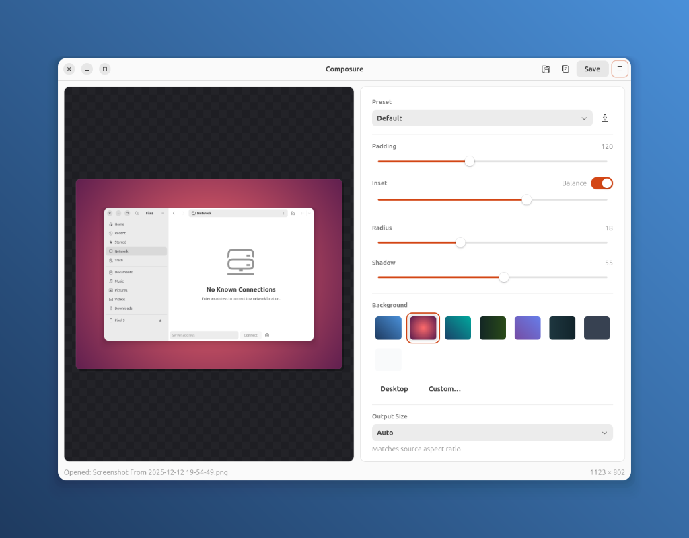

# Composure

**Linux Screenshot Beautifier** - Capture screenshots and compose them with pleasing backgrounds, shadows, and rounded corners.



*✨ This screenshot was taken with Composure! (Yes, it's that meta.)*

## Features

- 🎨 Beautiful gradient backgrounds
- 🔲 Rounded corners and shadows
- ✂️ Smart content-aware cropping
- 📋 Copy to clipboard (Wayland support)
- 💾 Export as PNG

## Installation

### Dependencies

```bash
sudo apt install python3-gi python3-gi-cairo gir1.2-gtk-4.0 gir1.2-adw-1 python3-pil python3-numpy wl-clipboard ydotool
```

### Run

```bash
cd Composure
python3 -m src.main
```

## Keyboard Shortcuts

| Shortcut | Action |
|----------|--------|
| `Ctrl+Shift+A` | Capture desktop → Composure |
| `Ctrl+Shift+B` | Capture selection → Composure |
| `Ctrl+Shift+C` | Capture window → Composure |
| `Ctrl+O` | Open image |
| `Ctrl+C` | Copy to clipboard |
| `Ctrl+S` | Save image |

## Setup Global Shortcuts

```bash
./scripts/setup-shortcuts.sh
```

## License

GPL-3.0
